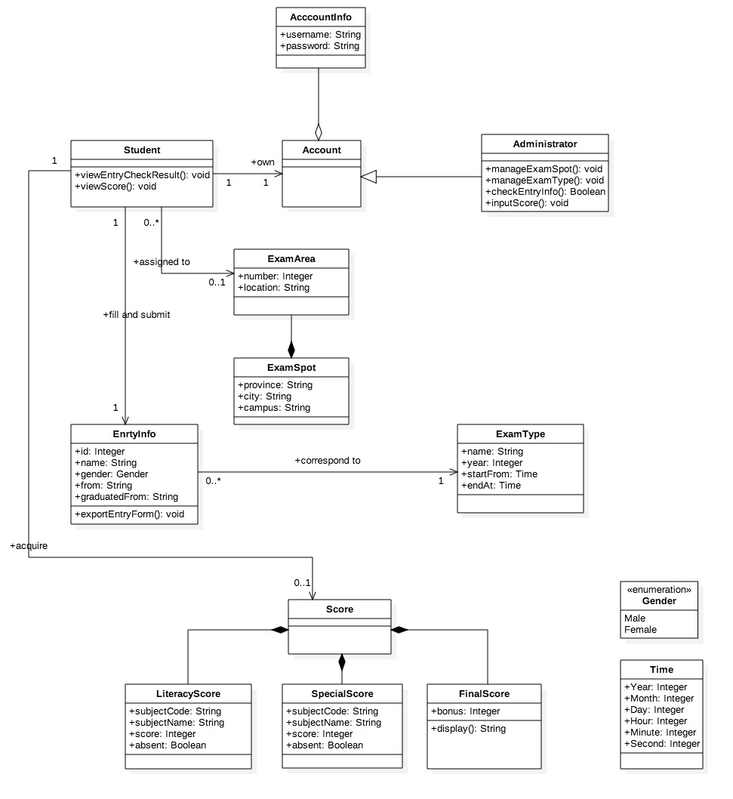
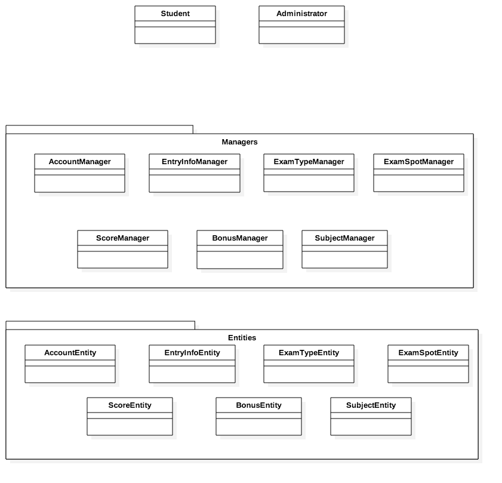

# 自主招生管理系统总结报告

##### 面向对象的分析与设计课程项目 [Github](https://github.com/liberion1994/oo/)

###### 李博远 2017-6-8

---

# 需求概况
- [原链接](https://github.com/SunflowerPKU/OO/blob/master/%E4%BD%9C%E4%B8%9A%E4%BA%8C--%E7%B3%BB%E7%BB%9F%E9%9C%80%E6%B1%82%E5%88%86%E6%9E%90.md)
- 主要涉众为考生和校内考务
- 考生、考务均能登录系统
- 考生可以提交报名信息，其中需要包括考试类型和其他信息
- 考生可以确认报名信息，确认后无法修改
- 考务可以对考生确认的报名信息进行审核
- 对于审核通过的报名信息，考生可以选择考点
- 考试结束后，考务可以录入成绩
- 考生可以查看考试的成绩
- 考务可以对考试类型、考试科目、考点等进行编辑
- *在考试15天前，考生可以取消已确认的报名信息*

---

# 设计类图

---

# 设计总结
- 基本正确表达了系统中的实体和实体间的关系
- 相较于解决方案，更接近于问题域
- 与最终实现有一定的差距
- 不是一个**非常合理**的设计

---

# 实现技术栈
- 开发语言：`Javascript`
- 项目管理：`NPM`
- 服务器：`Express.js`
- 身份认证：`Passport.js`
- 渲染：`React.js`
- 后端渲染：`Next.js`
- ORM：`Sequelize.js`
- 数据库 `MySQL`

---

# 实现类

---

# 分析
- 实现与设计时的类图有所不同，对于每个持久化数据实体，都又一个相应的Manager，负责对应实体的增删改查等操作
- Manager本身是单例的
- Manager实际上是工厂模式中的工厂类
- 设计是与选用的技术及框架分不开的（C/S+HTTP+SQL）

---

# 总结
- 面向对象方法从需求、分析、设计到实现，有一套完整的体系以及与之相应的强大的技术
- 面向对象过程将问题域到解空间的鸿沟一步步分解，一步一个脚印地走完整个流程
- 每一步的产出都是下一步的输入和依据，不能仅仅当作“没有实际意义的文档”而敷衍了事
- 面向对象设计的时候需要更多考虑解空间，因此需要考虑实现时的技术和框架
- 要对技术有深入而全面的掌握，否则会反过来影响设计的优劣
- 熟能生巧，不论是分析设计还是开发